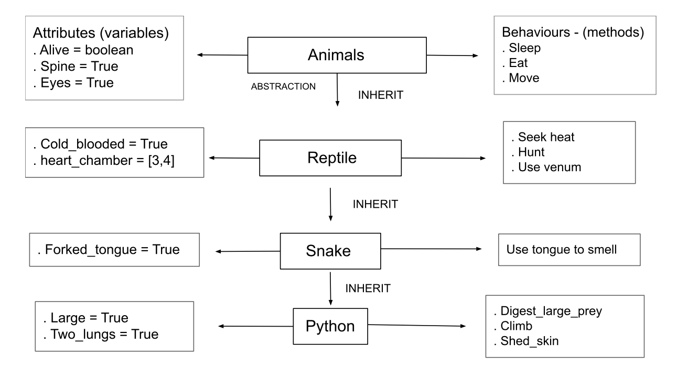

# Python OOP



#### Step 1:
````python
# create a Animal class
# syntax class name:

class Animal:
    # __init__ to declare class attribues (to initialise a class)

    def __init__(self): # self refers to current class
        self.alive = True
        self.spine = True

    def sleep(self):
        return "8 hours of sleep is advised"

    def eat(self):
        return "eat if you like to stay alive.. and eat healthy."

# create an object of the class before using it
cat = Animal()
print(cat.eat()) # abstarcted how was eat created or what info is available
````

#### Step 2:

Creating reptile file & inheriting from Animal class

````python
# inherit everything from Animal class into reptile
from animal import Animal

# create a reptile class
class Reptile(Animal): # write the name of the class in () - (parent class) to inherit
    # parent class - base class - super class

    def __init__(self):
        # need to let it know to inherit everything from parent class (Animal)
        super().__init__() # super is used to inherit everything from base class
        self.cold_blooded = True
        self.heart_chamber = [3, 4]

    def seek_heat(self):
        return "looking for the sun shine"

    def hunt(self):
        return "working hard to catch a next meal"

    # create an object of reptile class
reptile_object = Reptile()

#print(reptile_object.eat())
#print(reptile_object.hunt())
````

#### Step 3:
inherit from reptile (Encapsulation)

````python
# inherit reptile from Reptile class

from reptile import Reptile

class Snake(Reptile):

    def __init__(self):
        super().__init__()
        self.forked_tongue = True

    def use_tongue_to_smell(self):
        return "I can use my tongue to smell food"

    def _hibernate(self):
        return "protected method"

    def __shed(self):
        return "private method"


snake_object = Snake()
print(snake_object.eat()) # this function is inherited from Animal class
print(snake_object.seek_heat()) # this function is inherited from Reptile class
print(snake_object.use_tongue_to_smell()) # this function is inherited from the direct parent class snake

# create 2 more functions; one with _ the other one with __
# execute them both -return message should explain Encapsulation break down - public - protected - private

print(snake_object._hibernate()) # This is a protected method. prevents its usage by outside entities unless it is a subclass
print(snake_object.__shed) # This is a private method & will print 'AttributeERROR'
````
